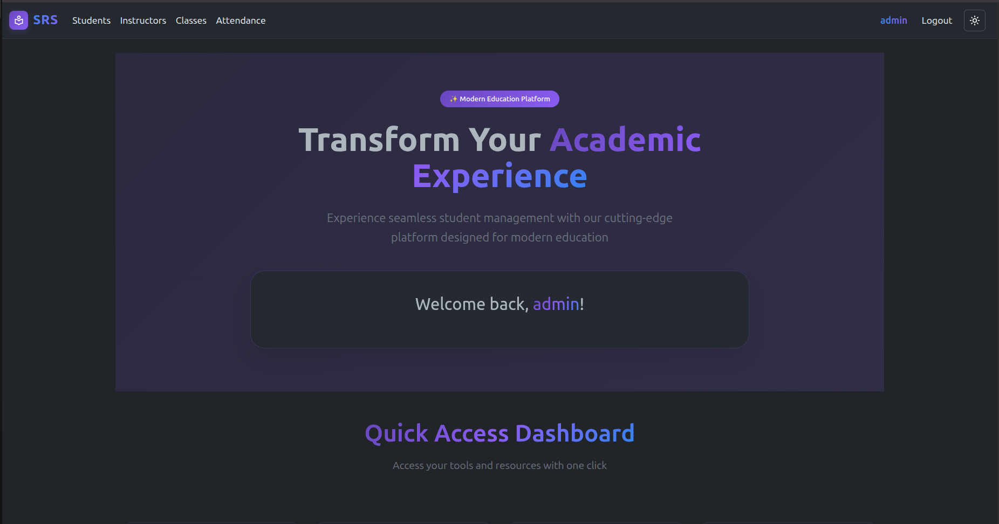

# Student Registration System

A comprehensive web application for managing student enrollment, class scheduling, instructor assignments, and attendance tracking in educational institutions.



## Description

The Student Registration System is a full-stack web application designed to streamline academic administration. It provides an intuitive interface for managing students, instructors, classes, and attendance records. The system features a modern, responsive design with both light and dark mode support, making it accessible and user-friendly for educational administrators.

## Background

This application was built to address the common challenges faced by educational institutions in managing their academic operations. Traditional paper-based systems or disconnected digital tools often lead to inefficiencies, data inconsistencies, and time-consuming administrative tasks. This centralized system provides a unified platform for all academic management needs, reducing administrative overhead and improving data accuracy.

## Getting Started

### Live Application
🚀 **[View Deployed App](https://student-registration-system-097d57e1c664.herokuapp.com/)**

### Planning Materials
📋 **[Project Planning & Wireframes](https://trello.com/b/aFO6fzND/project-2)** 

### Local Development

1. **Clone the repository**
   ```bash
   git clone <repository-url>
   cd Student-Registration-System
   ```

2. **Install dependencies**
   ```bash
   npm install
   ```

3. **Set up environment variables**
   Create a `.env` file in the root directory:
   ```env
   MONGODB_URI=your_mongodb_connection_string
   SESSION_SECRET=your_session_secret_key
   PORT=3000
   ```

4. **Seed the database with sample data**
   ```bash
   npm run seed
   ```

5. **Start the development server**
   ```bash
   npm run dev
   ```

6. **Access the application**
   Open your browser and navigate to `http://localhost:3000`

## Features

### 🎓 Student Management
- Add, edit, and view student profiles
- Upload student photos
- Track contact information and addresses
- Search and filter functionality

### 👨‍🏫 Instructor Management
- Manage instructor profiles and contact details
- Assign instructors to classes
- View instructor schedules

### 📚 Class Management
- Create and manage class schedules
- Set class capacity and room assignments
- Enroll students in classes with capacity controls
- Advanced student selection with search functionality

### 📊 Attendance Tracking
- Take daily attendance with multiple status options (Present, Late, Absent, Excused)
- View attendance history with pagination
- Generate attendance statistics and reports
- Visual progress indicators for attendance rates

### 🔐 Authentication & Security
- Secure user authentication system
- Session management
- Protected routes and data access

### 🎨 User Experience
- Responsive design for mobile and desktop
- Dark/Light mode support
- Intuitive navigation and user interface
- Real-time form validation

## Technologies Used

### Backend
- **Node.js** - Runtime environment
- **Express.js** - Web application framework
- **MongoDB** - NoSQL database
- **Mongoose** - MongoDB object modeling
- **Express Session** - Session management
- **Connect-Mongo** - MongoDB session store
- **bcrypt** - Password hashing
- **Method-Override** - HTTP method support

### Frontend
- **EJS** - Templating engine
- **Bootstrap 5** - CSS framework
- **Font Awesome** - Icon library
- **JavaScript** - Client-side interactivity

### Development Tools
- **Nodemon** - Development server auto-restart
- **Morgan** - HTTP request logger
- **dotenv** - Environment variable management

## Attributions

- **Bootstrap 5** - [https://getbootstrap.com/](https://getbootstrap.com/) - CSS framework for responsive design
- **Font Awesome** - [https://fontawesome.com/](https://fontawesome.com/) - Icon library
- **Random User API** - [https://randomuser.me/](https://randomuser.me/) - Profile images for seed data
- **MongoDB** - [https://www.mongodb.com/](https://www.mongodb.com/) - Database platform
- **Express.js** - [https://expressjs.com/](https://expressjs.com/) - Web framework

## Next Steps

### Planned Enhancements

#### 📈 Analytics & Reporting
- Advanced attendance analytics with charts and graphs
- Generate printable reports (PDF export)
- Student performance tracking
- Class performance comparisons


#### 🔔 Notification System
- Email notifications for low attendance
- Automated parent/guardian notifications
- Class schedule change alerts

#### 📅 Advanced Scheduling
- Drag-and-drop class scheduling interface
- Conflict detection for room and instructor scheduling
- Recurring class schedules
- Holiday and break management

#### 👥 Multi-Role Support
- Student portal for viewing their own records
- Parent/Guardian access to student information
- Administrative hierarchy and permissions

#### 🎯 Academic Features
- Grade management integration
- Assignment and homework tracking
- Academic calendar management
- Transcript generation

---

## Contributing

Contributions are welcome! Please feel free to submit a Pull Request.

## License

This project is licensed under the
